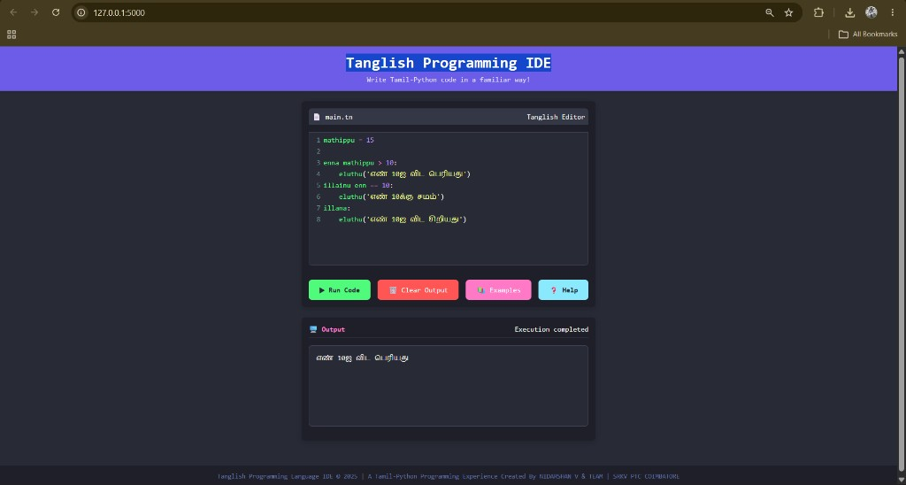

# 🌟 Tanglish Programming Language & Web IDE
> **A Tamil-Python Educational Programming Language & Interactive IDE**  
> *Diploma Final Year Project | Department of Computer Engineering | SRKV PTC Coimbatore*

---



---

## 📖 Table of Contents
- [About the Project](#-about-the-project)
- [Why Tanglish? (Real-World Impact & Usefulness)](#-why-tanglish-real-world-impact--usefulness)
- [Core Features](#-core-features)
- [Tanglish Keyword Cheatsheet](#-tanglish-keyword-cheatsheet)
- [Code Examples](#-code-examples)
- [Project Architecture & Directory Structure](#-project-architecture--directory-structure)
- [Installation & Quick Start](#-installation--quick-start)
- [Testing & Quality Assurance](#-testing--quality-assurance)
- [Future Scope & Cloud Hosting](#-future-scope--cloud-hosting)
- [Credits & Acknowledgments](#-credits--acknowledgments)

---

## 💡 About the Project

**Tanglish** is a specialized, beginner-friendly programming language compiler that allows students and programmers to write computer code using phonetically transliterated Tamil (Tanglish) keywords. 

It transpiles Tanglish syntax into optimized Python 3 code in real-time, executing it securely and streaming output back to an integrated web-based terminal.

### The Tanglish Philosophy:
Instead of forcing beginners to memorize foreign English terminology, Tanglish connects programming logic directly with their mother tongue:
- `eluthu` replaces `print` (எழுது)
- `enna` replaces `if` (என்ன)
- `illana` replaces `else` (இல்லனா)
- `neram` replaces `while` (நேரம் / சுழற்சி)
- `payan` replaces `for` (பயன்)
- `varu` replaces `def` (வரு / செயல்பாடு)
- `vaangu` replaces `input` (வாங்கு / உள்ளீடு)

---

## 🚀 Why Tanglish? (Real-World Impact & Usefulness)

### 1. Breaking the Language Barrier in Tech
In rural and regional institutions, students often grasp algorithmic logic quickly, but struggle with English-first programming syntax. Tanglish removes this barrier by letting learners express their logic in everyday spoken Tamil.

### 2. Cognitive Load Reduction
Novice programmers normally face a double cognitive burden:
1. Understanding the computational logic (loops, conditions, variables).
2. Translating that thought into unfamiliar English keywords.  
**Tanglish eliminates the second step**, enabling faster comprehension of core programming concepts.

### 3. Stepping Stone to Industry-Standard Python
Because Tanglish directly compiles to Python, students don't learn a "toy" system—they learn Python's exact structure, indentation rules, and execution flow. Transitioning to standard Python is straightforward once core logic is mastered.

### 4. Interactive Learning in the Browser
No complex command-line setup or compilers are needed for students. Opening the web interface provides an immediate CodeMirror editor, autocomplete, and live execution console.

### 5. Tamil Error Diagnostics
Standard Python syntax errors (like `NameError`, `IndentationError`, `ZeroDivisionError`) are translated into clear, descriptive Tamil error messages, helping beginners identify and fix bugs without frustration.

---

## 🛠️ Core Features

- ⚡ **Tokenizer-Based Compiler**: Uses Python's native `tokenize` module to parse code safely. Words inside string literals (`"enna thambi"`) and comments are protected from substitution.
- 🎨 **Modern Dark-Mode Web IDE**: Features the Dracula color theme, line numbering, auto-bracket completion, and syntax highlighting.
- 🔍 **Live Autocomplete & Spellcheck**: Press `Ctrl+Space` or type keywords to receive instant Tanglish keyword suggestions.
- 💬 **Bidirectional Interactive Input (`vaangu`)**: The IDE pauses execution dynamically and prompts the user for keyboard input in real-time over WebSockets.
- 📚 **Integrated Cheat Sheet & Samples**: One-click help modal listing all Tamil keywords, standard libraries, and pre-loaded sample programs.
- 🛡️ **Session-Isolated Execution**: Thread-safe execution buffers ensure multiple users can run code without cross-contaminating outputs.

---

## 📑 Tanglish Keyword Cheatsheet

### 1. Control Flow
| Tanglish Keyword | Python Equivalent | Meaning / விளக்கம் |
|---|---|---|
| `enna` | `if` | நிபந்தனை தொடக்கம் (If condition) |
| `illainu` | `elif` | மாற்று நிபந்தனை (Else-If) |
| `illana` | `else` | இறுதி மாற்று (Else fallback) |
| `neram` | `while` | சுழற்சி (While loop) |
| `payan` | `for` | வரிசை சுழற்சி (For loop) |
| `thodar` | `continue` | அடுத்த சுழற்சிக்கு செல் |
| `niruthu` | `break` | சுழற்சியை நிறுத்து |

### 2. Functions & Scope
| Tanglish Keyword | Python Equivalent | Meaning / விளக்கம் |
|---|---|---|
| `varu` | `def` | புதிய செயல்பாடு (Define function) |
| `mudivu` | `return` | முடிவு / விடை (Return value) |
| `sila` | `lambda` | பெயர் இல்லாத செயல்பாடு (Anonymous lambda) |
| `ezhuthapadum` | `global` | உலகளாவிய மாறி (Global scope) |

### 3. Data Types & Conversion
| Tanglish Keyword | Python Equivalent | Meaning / விளக்கம் |
|---|---|---|
| `saram` / `saram_akku` | `str` | சரம் / உரை (String) |
| `enn` / `enn_akku` | `int` | முழு எண் (Integer) |
| `midhaenn` / `midhaenn_akku` | `float` | தசம எண் (Float) |
| `ulmai` / `ulmai_akku` | `bool` | உண்மை/பொய் (Boolean) |
| `pattial` / `pattial_akku` | `list` | பட்டியல் (List) |
| `agarathi` / `agarathi_akku` | `dict` | அகராதி (Dictionary) |
| `thoguthy` | `set` | தொகுதி (Set) |
| `neelamm` | `len` | நீளம் (Length of list/string) |

### 4. Input & Output
| Tanglish Keyword | Python Equivalent | Meaning / விளக்கம் |
|---|---|---|
| `eluthu` | `print` | திரையில் காட்டு (Print output) |
| `vaangu` | `input` | பயனர் உள்ளீடு பெறு (User input) |

### 5. Standard Library Modules
| Tanglish Module | Python Library | Description |
|---|---|---|
| `kanitham` | `math` | கணித செயல்பாடுகள் (sin, cos, sqrt, pi) |
| `elamai` | `random` | சீரற்ற எண்கள் தேர்வு (randint, choice) |
| `kaalam` / `neram_mod`| `time` | நேரம் மற்றும் தூக்கம் (time, sleep) |
| `seyalmurai` | `os` | கோப்பக செயல்பாடுகள் (files, paths) |
| `niralakki` | `datetime` | தேதி மற்றும் நேரம் |

---

## 💻 Code Examples

### 1. Hello World (வணக்கம் உலகம்)
```python
# Tanglish
eluthu("வணக்கம் உலகம்!")
```

### 2. Functions & Arithmetic (கணிப்பான்)
```python
varu koottu(a, b):
    mudivu a + b

varu kazhi(a, b):
    mudivu a - b

enn1 = 20
enn2 = 10
eluthu("கூட்டல் விடை: ", koottu(enn1, enn2))
eluthu("கழித்தல் விடை: ", kazhi(enn1, enn2))
```

### 3. While Loop (சுழற்சி)
```python
count = 0
neram count < 5:
    eluthu("தற்போதைய எண்: ", count)
    count = count + 1
```

### 4. Interactive User Input (பயனர் உள்ளீடு)
```python
peyar = vaangu("உங்கள் பெயர் என்ன? ")
vayathu = enn_akku(vaangu("உங்கள் வயது என்ன? "))

enna vayathu >= 18:
    eluthu(f"வணக்கம் {peyar}, நீங்கள் வாக்களிக்க தகுதியானவர்!")
illana:
    eluthu(f"வணக்கம் {peyar}, நீங்கள் இன்னும் வாக்களிக்க முடியாது.")
```

---

## 📂 Project Architecture & Directory Structure

```
diplamo final year project (file)/
│
├── thanglish.py          # Core Tanglish compiler, parser & execution engine
├── server.py            # Flask + Flask-SocketIO real-time backend
├── requirements.txt     # Python runtime dependencies
├── run_server.bat       # Windows 1-click execution launcher
├── test_compiler.py     # Automated test suite for compiler features
├── test_server.py       # Automated test suite for server endpoints
│
├── templates/
│   └── index.html       # Web IDE interface (CodeMirror + Dracula + WebSockets)
│
├── assets/
│   └── tanglish_ide_preview.jpg  # Project preview screenshot
│
└── README.md            # Comprehensive project documentation
```

---

## ⚙️ Installation & Quick Start

### Prerequisites
- **Python 3.8+** installed on your system ([Download Python](https://www.python.org/downloads/))

### Step 1: Clone or Navigate to the Directory
```powershell
cd "diplamo final year project (file)"
```

### Step 2: Install Dependencies
```powershell
pip install -r requirements.txt
```

### Step 3: Run the Server
- **Option A (Double-Click)**: Simply double-click `run_server.bat`.
- **Option B (Command Line)**:
  ```powershell
  python server.py
  ```
The server will start at **`http://127.0.0.1:5000`** and open your browser automatically.

### Step 4: Interactive Terminal REPL Mode
To run Tanglish directly in the terminal without opening a browser:
```powershell
python thanglish.py
```
Type `SOLLU THAMBI>>> eluthu("வணக்கம்")` and press Enter!

---

## 🧪 Testing & Quality Assurance

Automated unit tests ensure the language compiler and backend are 100% stable:

```powershell
# Run compiler language tests
python test_compiler.py

# Run backend endpoint tests
python test_server.py
```

**Verification Results:**
- `8/8 Compiler Tests Passed` (Print, Loops, Functions, Math, Conditionals, String Protection).
- `All Server Tests Passed` (Template serving, WebSockets, HTTP `/run`).

---

## ☁️ Future Scope & Cloud Hosting

1. **Free Cloud Deployment**:
   - The application can be deployed for free on **Streamlit Cloud**, **Render.com**, or **Railway.app** to provide an instant public URL for evaluators.
2. **Tamil Script Input Support**:
   - Currently, Tanglish uses phonetic English script (`eluthu`, `enna`). Expanding to native Tamil unicode script (`எழுது`, `என்ன`) as first-class tokens.
3. **Mobile Responsive PWA**:
   - Progressive Web App support for running Tanglish programs offline on tablets and mobile phones in schools.

---

## 🎓 Credits & Acknowledgments

- **Project Title**: Tanglish Programming Language & Web IDE
- **Course**: Diploma in Computer Engineering (Final Year Project)
- **Institution**: Sri Ramakrishna Mission Vidyalaya Polytechnic College (SRKV PTC), Coimbatore
- **Team**: Nidarshan V & Team
- **Mentor / Faculty Guidance**: Department of Computer Engineering
